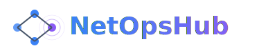

<p align="center">
  
</p>

<h1 align="center">NetOpsHub</h1>

<p align="center">
  <strong>AI-Native Network Operations Platform</strong><br/>
  Multi-agent intelligence for monitoring, troubleshooting, and automating multi-vendor networks.
</p>

<p align="center">
  <a href="https://github.com/cwccie/netopshub/actions/workflows/ci.yml"></a>
  <a href="https://pypi.org/project/netopshub/"></a>
  <a href="https://opensource.org/licenses/MIT"></a>
  <a href="https://python.org"></a>
  <a href="https://www.typescriptlang.org/"></a>
  <a href="https://netopshub.com"></a>
</p>

---

## The Problem

**Cross-domain network troubleshooting in hybrid multi-vendor environments is fundamentally unsolved.**

Today's networks span Cisco, Juniper, Arista, Palo Alto, and cloud fabrics — each with different CLIs, different telemetry formats, and different failure modes. When BGP flaps between an Arista leaf and a Cisco spine at 2 AM, engineers face:

- **Tool sprawl** — SNMP pollers, syslog aggregators, NetFlow analyzers, and config managers in separate panes
- **Vendor silos** — Cisco TAC docs don't reference Juniper behavior; Arista's EOS quirks aren't in Datadog runbooks
- **Alert fatigue** — 500 SNMP traps fire simultaneously, but only one is the root cause
- **Knowledge drain** — The senior engineer who knows *why* OSPF area 0 fragments under MPLS TE is retiring next quarter

**NetOpsHub solves this with an AI-native approach**: a coordinated multi-agent system that discovers your topology, ingests vendor documentation via RAG, detects anomalies across domains, and performs topology-aware root cause analysis — then proposes verified remediation with human-in-the-loop approval.

---

## Architecture

```
┌─────────────────────────────────────────────────────────────────────┐
│                        NetOpsHub Platform                           │
├─────────────────────────────────────────────────────────────────────┤
│                                                                     │
│  ┌─────────────┐  ┌──────────────┐  ┌────────────────────────────┐ │
│  │  React SPA   │  │  FastAPI      │  │  Agent Orchestrator        │ │
│  │  Dashboard   │──│  REST API     │──│  (LangGraph-style)         │ │
│  │  Topology    │  │  WebSocket    │  │                            │ │
│  │  AI Chat     │  │  /api/v1/*    │  │  ┌────────┐ ┌──────────┐  │ │
│  │  Alerts      │  │               │  │  │Discovery│ │Knowledge │  │ │
│  │  Compliance  │  │               │  │  │Agent    │ │Agent     │  │ │
│  └─────────────┘  └──────┬───────┘  │  └────────┘ └──────────┘  │ │
│                          │          │  ┌────────┐ ┌──────────┐   │ │
│                          │          │  │Diagnosis│ │Compliance│   │ │
│                          │          │  │Agent    │ │Agent     │   │ │
│                          │          │  └────────┘ └──────────┘   │ │
│                          │          │  ┌────────┐ ┌──────────┐   │ │
│                          │          │  │Forecast │ │Remediate │   │ │
│                          │          │  │Agent    │ │Agent     │   │ │
│                          │          │  └────────┘ └──────────┘   │ │
│                          │          │  ┌────────────────────────┐ │ │
│                          │          │  │Verification Agent      │ │ │
│                          │          │  └────────────────────────┘ │ │
│                          │          └────────────────────────────┘ │
│                          │                                         │
│  ┌───────────────────────┴──────────────────────────────────────┐  │
│  │                    Collection Engine                          │  │
│  │  ┌──────────┐ ┌──────────┐ ┌──────────┐ ┌────────────────┐  │  │
│  │  │SNMP      │ │NetFlow   │ │Syslog    │ │REST API        │  │  │
│  │  │v2c/v3    │ │v5/v9/    │ │RFC 5424  │ │Collector       │  │  │
│  │  │Poller    │ │IPFIX     │ │Listener  │ │(vendor APIs)   │  │  │
│  │  └──────────┘ └──────────┘ └──────────┘ └────────────────┘  │  │
│  └──────────────────────────────────────────────────────────────┘  │
│                                                                     │
│  ┌────────────┐ ┌────────────┐ ┌────────────┐ ┌────────────────┐  │
│  │  Qdrant     │ │  Redis      │ │  TimescaleDB│ │  PostgreSQL   │  │
│  │  (RAG)      │ │  (Cache)    │ │  (Metrics)  │ │  (Inventory)  │  │
│  └────────────┘ └────────────┘ └────────────┘ └────────────────┘  │
└─────────────────────────────────────────────────────────────────────┘
                              │
                    ┌─────────┴─────────┐
                    │   Network Devices   │
                    │  Cisco · Juniper    │
                    │  Arista · Palo Alto │
                    │  Cloud Fabrics      │
                    └─────────────────────┘
```

---

## Features

### Collection Engine
- **SNMP v2c/v3 polling** with adaptive intervals and bulk operations
- **NetFlow v5/v9/IPFIX** receiver with flow aggregation and top-talker analysis
- **Syslog listener** (RFC 3164/5424) with severity classification and pattern extraction
- **REST API collector** for vendor-specific APIs (Meraki, Arista eAPI, Palo Alto XML API)
- **Unified metric format** — all telemetry normalized to a common schema

### Network Discovery
- **LLDP/CDP auto-topology** — builds a live graph of device interconnections
- **SNMP device enumeration** — inventory of all managed devices with platform detection
- **Interface inventory** — speed, duplex, VLAN, IP addressing, admin/oper status
- **Neighbor relationships** — BGP peers, OSPF adjacencies, EIGRP neighbors

### Health Monitoring
- **CPU / Memory / Bandwidth / Error metrics** with configurable thresholds
- **Multi-severity alerting** (info → warning → critical → emergency)
- **Trend tracking** with linear regression and seasonal decomposition
- **SLA monitoring** — latency, jitter, packet loss against defined baselines

### Multi-Agent Intelligence

| Agent | Capability |
|-------|-----------|
| **Discovery** | Scans networks via MCP tools, builds topology graph, detects new devices |
| **Knowledge** | RAG over vendor docs (Qdrant + chunking), answers "what does this error mean?" |
| **Diagnosis** | Anomaly correlation, topology-aware root cause analysis, blast radius estimation |
| **Compliance** | Checks running configs against NIST 800-53, CIS Benchmarks, PCI-DSS, custom baselines |
| **Forecast** | Capacity planning, failure prediction via time-series analysis, bandwidth exhaustion ETA |
| **Remediation** | Generates config change proposals, diff preview, rollback plan, HITL approval gate |
| **Verification** | Post-change health checks, validates fix resolved the issue, monitors for regression |
| **Coordinator** | LangGraph-style orchestration, routes tasks to agents, manages conversation state |

### Configuration Management
- **Config backup** with version history and Git-style diffing
- **Compliance baseline** enforcement (golden configs)
- **Change tracking** with blame, timestamps, and correlation to incidents

### Anomaly Detection
- **Statistical methods** — Z-score, IQR, EWMA with adaptive thresholds
- **ML-based detection** — Isolation Forest, DBSCAN for multivariate anomaly detection
- **Maintenance-window awareness** — suppresses alerts during planned changes
- **Correlation engine** — groups related anomalies across devices and metrics

---

## Quick Start

### Docker Compose (Recommended)

```bash
git clone https://github.com/cwccie/netopshub.git
cd netopshub
cp .env.example .env   # Configure your API keys
docker-compose up -d
```

Open [http://localhost:3000](http://localhost:3000) for the dashboard, or [http://localhost:8000/docs](http://localhost:8000/docs) for the API.

### Development Setup

```bash
# Backend
cd backend
python -m venv .venv && source .venv/bin/activate
pip install -e ".[dev]"
netopshub serve --reload

# Frontend
cd frontend
npm install
npm run dev
```

### CLI

```bash
# Discover devices on a subnet
netopshub discover --subnet 10.0.0.0/24

# Check device health
netopshub monitor --device router-core-1

# Run compliance audit
netopshub compliance --framework nist-800-53

# Chat with the AI
netopshub chat "Why is BGP flapping on router-core-1?"
```

---

## Screenshots

> **Coming soon** — screenshots of the dashboard, topology map, AI chat, and compliance reports.

| Dashboard | Topology | AI Chat |
|-----------|----------|---------|
|  |  |  |

---

## Revenue Model

| Tier | Price | Limits |
|------|-------|--------|
| **Community** | Free | 10 devices, 1 user, community support |
| **Pro** | $29/mo | 100 devices, 5 users, email support, all agents |
| **Enterprise** | Custom | Unlimited devices, SSO/SAML, dedicated support, on-prem deployment |

All tiers include the full open-source platform. Pro and Enterprise add managed cloud hosting, premium integrations (ServiceNow, PagerDuty), and SLA guarantees.

---

## How NetOpsHub Compares

| Capability | NetOpsHub | Auvik | PRTG | Datadog Network |
|-----------|-----------|-------|------|-----------------|
| AI-native troubleshooting | **Yes** — multi-agent RCA | No | No | Basic |
| RAG over vendor docs | **Yes** — Qdrant + chunking | No | No | No |
| Multi-vendor topology | **Yes** — LLDP/CDP auto-discovery | Yes | Limited | Yes |
| Compliance auditing | **Yes** — NIST/CIS/PCI-DSS | No | No | No |
| Predictive analytics | **Yes** — failure + capacity forecast | No | Basic | Yes |
| Config management | **Yes** — backup, diff, rollback | Yes | No | No |
| Open source | **Yes** — MIT license | No | No | No |
| Self-hosted option | **Yes** — Docker or bare metal | No | Yes | No |
| Starting price | **Free** (10 devices) | $$$  | $$  | $$$$ |

---

## Tech Stack

**Backend**: Python 3.11+ · FastAPI · Pydantic v2 · SQLAlchemy · Celery · Redis
**AI/ML**: LangChain · LangGraph · Qdrant · scikit-learn · NumPy · SciPy
**Frontend**: React 18 · TypeScript 5 · Vite · TailwindCSS · Recharts · React Flow
**Infrastructure**: Docker · PostgreSQL · TimescaleDB · Redis · Qdrant
**Protocols**: SNMP v2c/v3 · NetFlow v5/v9/IPFIX · Syslog RFC 5424 · SSH/NETCONF

---

## Project Structure

```
netopshub/
├── backend/
│   └── src/netopshub/
│       ├── collect/        # SNMP, NetFlow, Syslog, REST collectors
│       ├── discover/       # LLDP/CDP topology, device enumeration
│       ├── monitor/        # Health metrics, alerting, SLA tracking
│       ├── agents/         # 7 AI agents + coordinator
│       ├── config/         # Config backup, diff, compliance baseline
│       ├── anomaly/        # Statistical + ML anomaly detection
│       ├── api/            # FastAPI REST + WebSocket endpoints
│       └── cli.py          # Click CLI
├── frontend/
│   └── src/
│       ├── pages/          # Dashboard, Topology, Chat, Alerts, Compliance
│       ├── components/     # Reusable UI components
│       └── hooks/          # React hooks for API integration
├── tests/                  # 50+ backend tests
├── docker-compose.yml
├── Dockerfile
└── pyproject.toml
```

---

## Contributing

See [CONTRIBUTING.md](CONTRIBUTING.md) for development setup, coding standards, and submission guidelines.

---

## Author

**Corey A. Wade**
CCIE #14124 · CISSP · PhD Candidate (AI + Security)
[netopshub.com](https://netopshub.com) · [GitHub](https://github.com/cwccie)

---

## License

[MIT](LICENSE) — use it, fork it, build on it.
